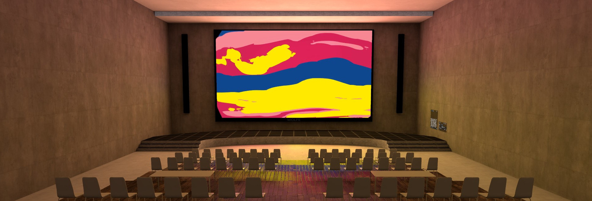
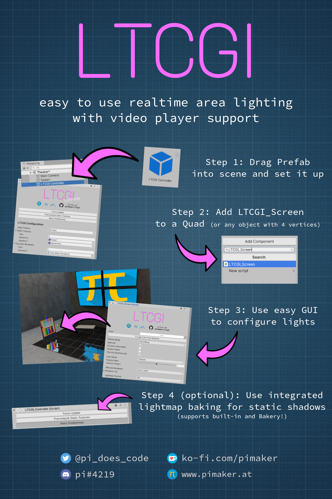
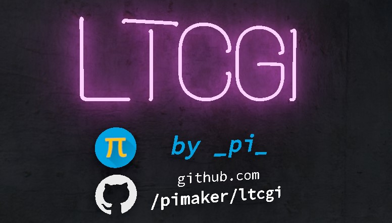
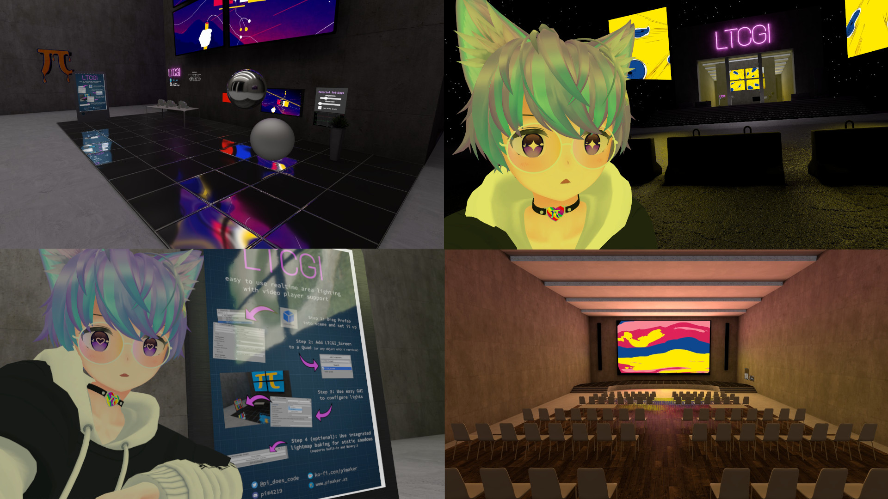
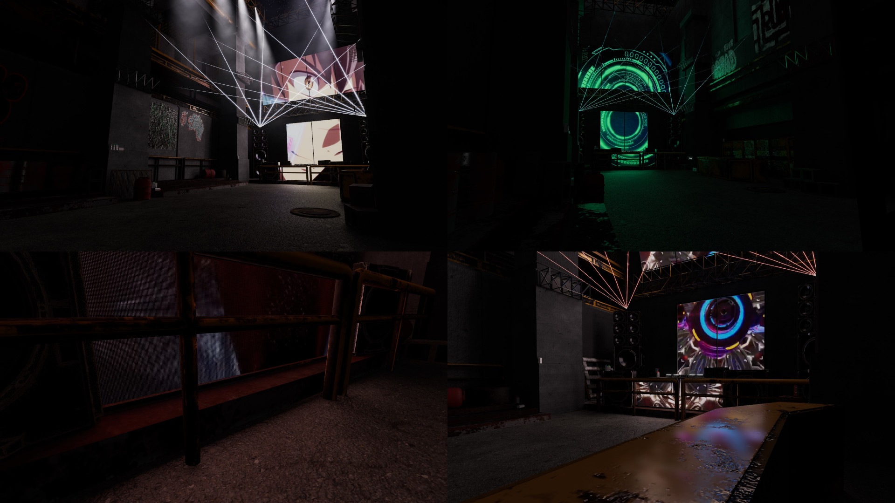
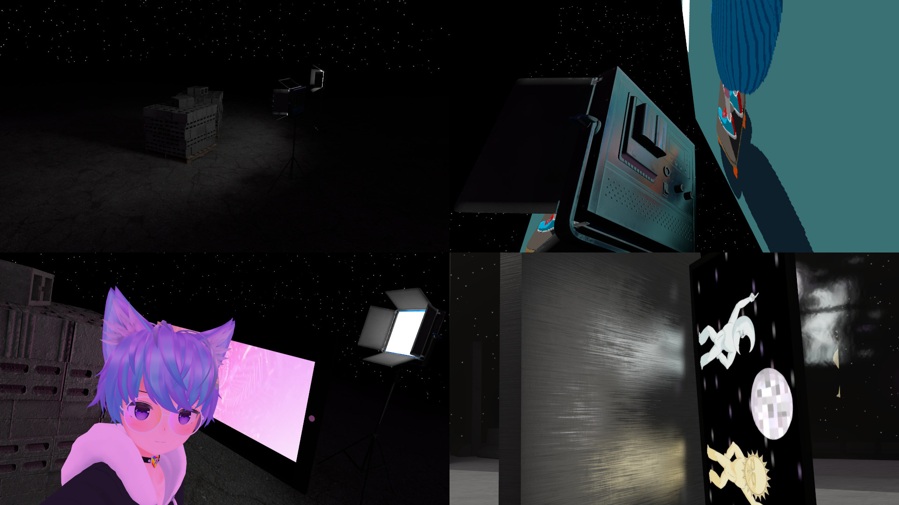
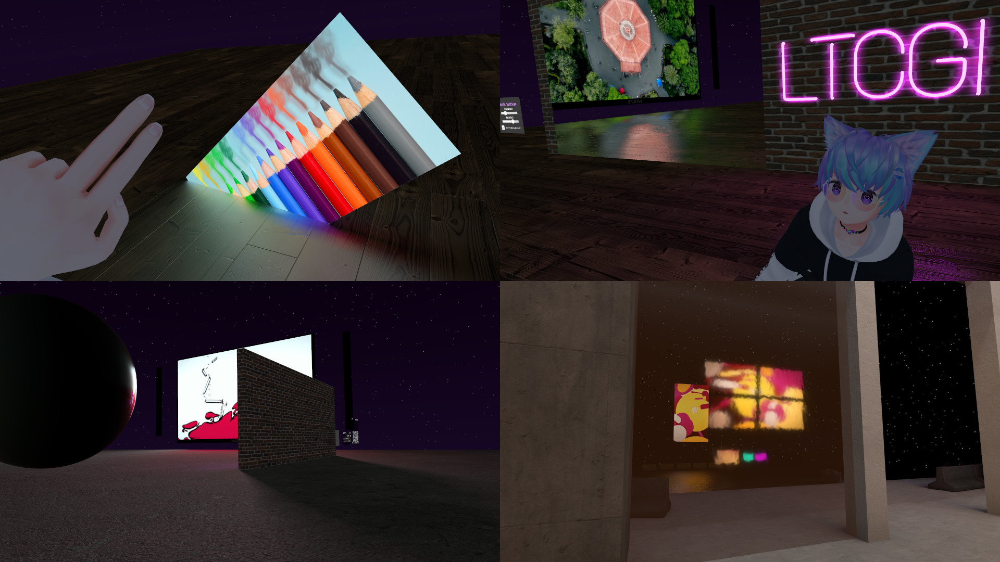

# LTCGI

Optimized plug-and-play realtime area lighting using the [linearly transformed cosine algorithm](#LTC) for Unity/VRChat. Free to use with [attribution](#Attribution).

Check the [Releases](https://github.com/PiMaker/ltcgi/releases) tab for downloads.

If you like this prefab, consider [supporting me on KoFi](https://ko-fi.com/pimaker)!



  
(demo video by [@orels1](https://github.com/orels1))

## Supported shaders

To use LTCGI, all objects that should receive lighting must use a compatible shader. Currently compatible ones are listed below. If you implement LTCGI into your shader, feel free to send a PR to be included.

* Basic "Unlit" Test Shader (included)
* Unity Standard Surface Shader (included)
* [z3y's Simple Lit](https://github.com/z3y/shaders)

## How to use



In written form:

* Put prefab into scene
* Optional: Set video render texture on the controller object (use [lox9973's VideoRT](https://drive.google.com/file/d/1XQBybXg2D87AueLI87UuujA3jDN4fU33/view) or similar for AVPro)
* Add LTCGI_Screen component to a quad or other MeshRenderer with 4 vertices
* Hit CTRL-S or use `Tools/LTCGI/Force Update` to update the editor representation
* Use GUI settings to configure your light, upload, enjoy :)

## Attribution

According to the [License](#License) you are free to use this in your world, but you need to give credit. You are free to do so in whichever way, but you must provide a link to this GitHub repository, such as to fulfill the imported license of the LTC example code used as a base for this project.

For your convenience, a prefab called `LTCGI Attribution` is provided in the package.



If you don't want to use it, instead display text similar to the following:

```
This project/world uses LTCGI by _pi_, see 'github.com/pimaker/ltcgi'.
```

## Screenshots

  
([LTCGI demo hall](https://vrchat.com/home/launch?worldId=wrld_aa2627ec-c63a-4db2-aa3e-9078d41c6d9c))

  
(venue designed by BananaBread)

  
(various surfaces)

  
(static textures, shadows and glass)

## LTC

Based on this paper:
```
Real-Time Polygonal-Light Shading with Linearly Transformed Cosines.
Eric Heitz, Jonathan Dupuy, Stephen Hill and David Neubelt.
ACM Transactions on Graphics (Proceedings of ACM SIGGRAPH 2016) 35(4), 2016.
Project page: https://eheitzresearch.wordpress.com/415-2/
```
[Read more](https://eheitzresearch.wordpress.com/415-2/)

## License

This project is made available under the terms of the MIT license, unless explicitly marked otherwise in the source files. See `LICENSE` for more.

The following files are licensed explicitly, and may not be modified or used in commercial projects, but can be redistributed and displayed otherwise, provided this license is kept:

* Propaganda/pi_graffiti.png
* Propaganda/ltcgi_graffiti.png
